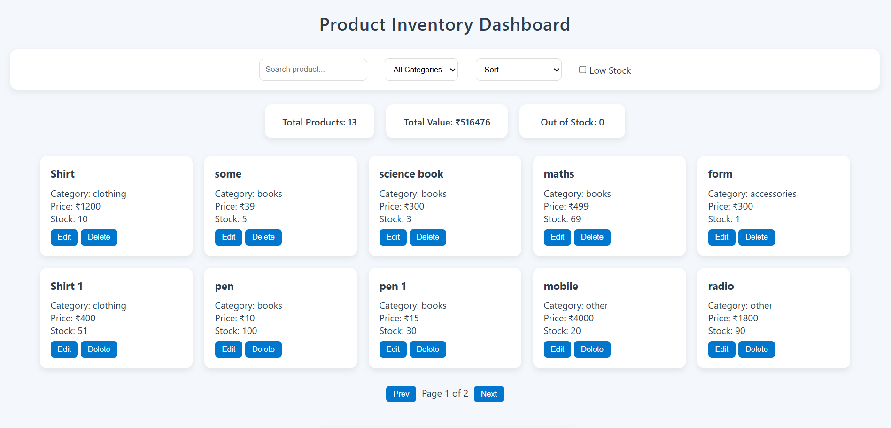
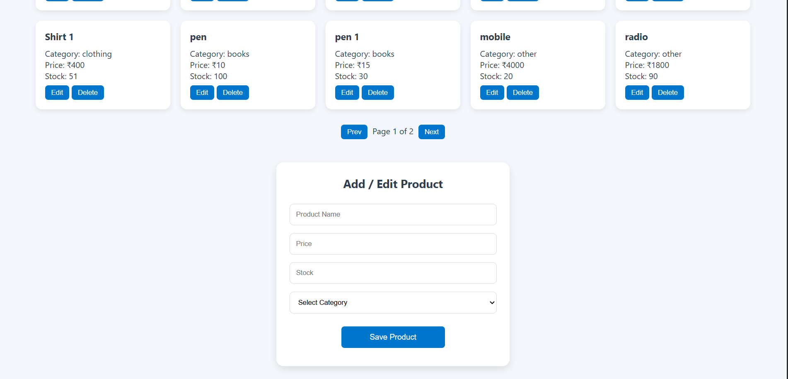
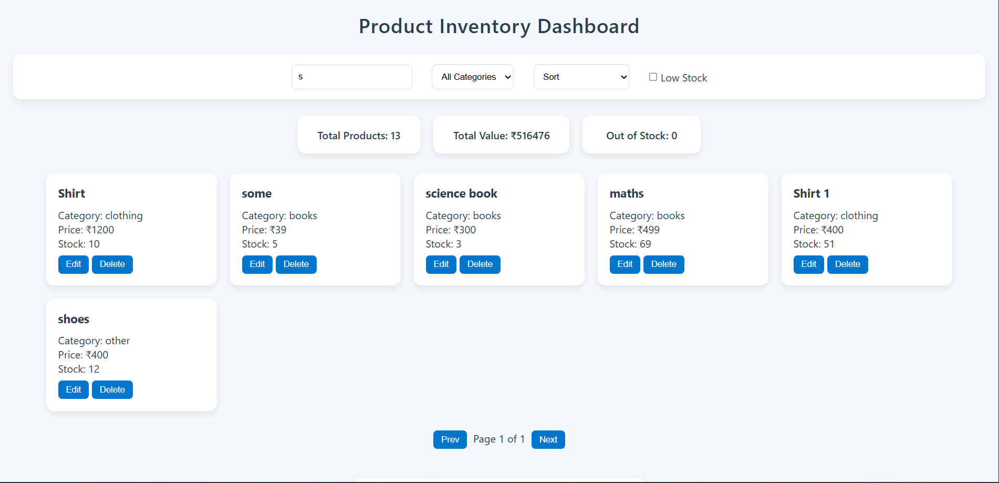
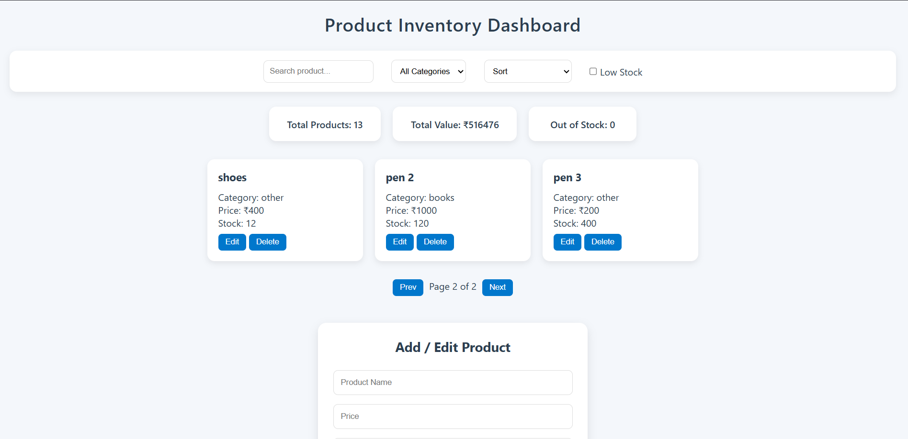
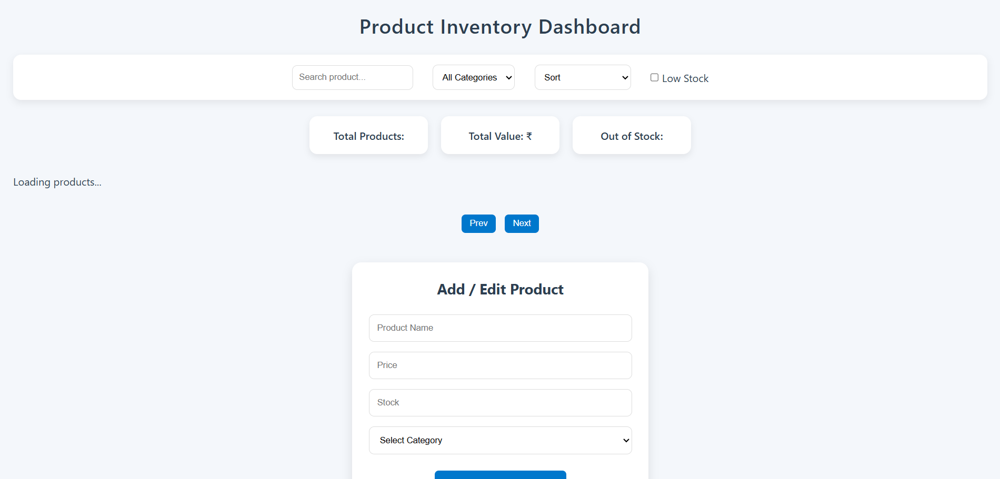
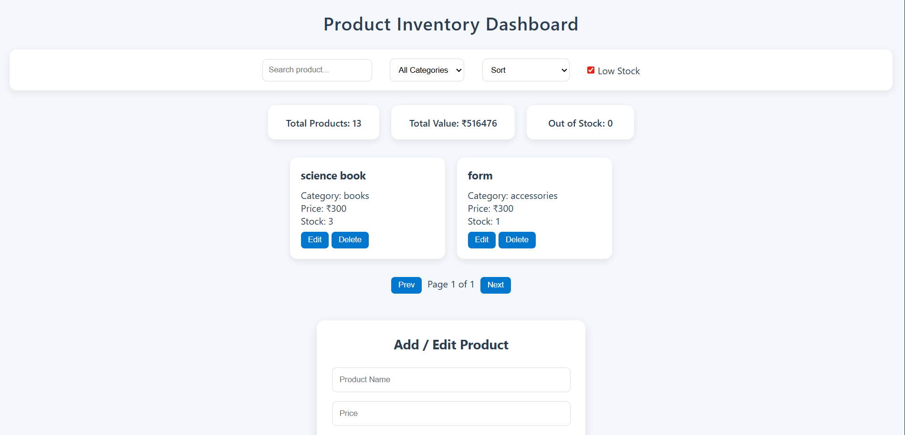

# Product Inventory Dashboard

## Project Overview

This project is a **Product Inventory Management Dashboard** built using **HTML, CSS, and JavaScript**.

this application use the browser **localStorage**, so the data remains saved even after refreshing the page.

---

## Features

- Add new products
- Edit existing products
- Delete products
- Search products by name
- Filter products by category
- Filter low stock items
- Sort products (price & name)
- Analytics (Total Products, Total Value, Out of Stock)
- Pagination for better data handling
- Data persistence using localStorage
- Fully responsive design

---

## Screenshots

### 1. Dashboard View

Displays all products in a card layout along with analytics.



**Description:**
This screen shows the main dashboard where all products are listed. It also displays total products, total inventory value, and out-of-stock items.

---

### 2. Add / Edit Product

Form used to add or update product details.



**Description:**
This section allows users to enter product name, price, stock, and category. The same form is used for editing existing products.

---

### 3. Search & Filter

Controls for filtering and searching products.



**Description:**
Users can search products by name, filter by category, and view low stock items. Sorting options are also available.

---

### 4. Pagination

Navigation between multiple pages of products.



**Description:**
Pagination helps in managing large product lists by dividing them into pages.

---

### 5. Loading

Show the data loading in local storage.



**Description:**
This is show the data loading just like data is fetch by backend take some time that time loader is show.

---

### 5. Low Stock

Show the low stock .



**Description:**
This is show low stock products that is the product quantity is less than 5 that is low stock product.

---

## How It Works

- All product data is stored in an **array of objects**
- Data is saved in **localStorage**
- UI is dynamically updated using JavaScript
- Filtering, sorting, and pagination are applied on the data before rendering

---

## Technologies Used

- HTML5
- CSS3 (Flexbox & Grid)
- JavaScript (ES6)
- Browser localStorage

---

## How to Run the Project

1. Clone the repository:

   ```bash
   git clone https://github.com/gourshabrg/Assignment/tree/main/Ravindra_frontend/mini_app
   ```

2. Open the project folder

3. Open `index.html` in any browser
   (Chrome, Edge, Firefox)

---
