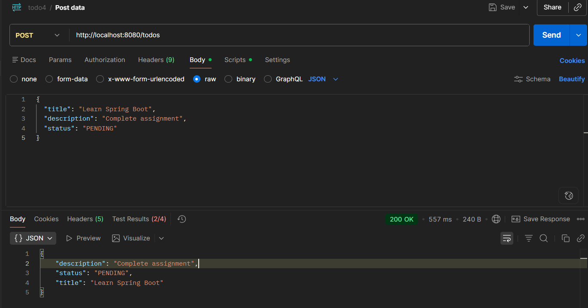
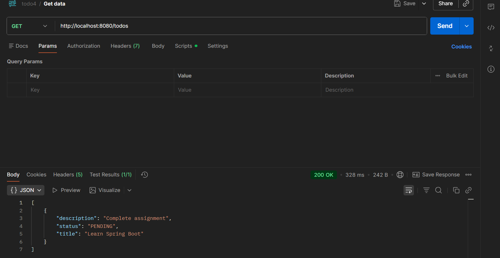
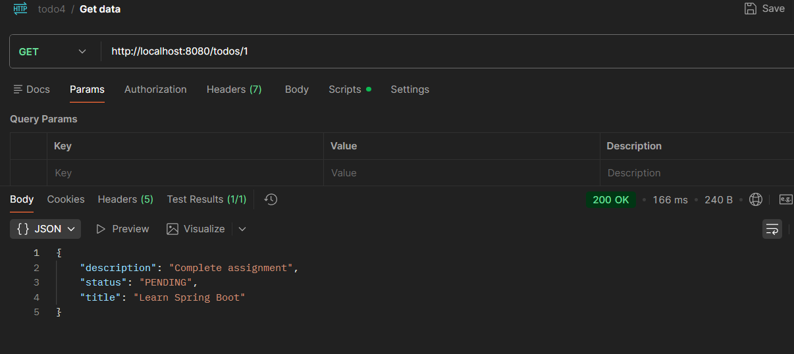
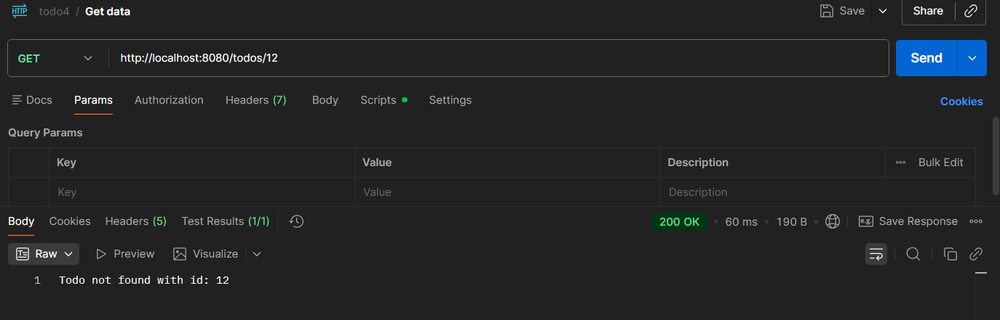
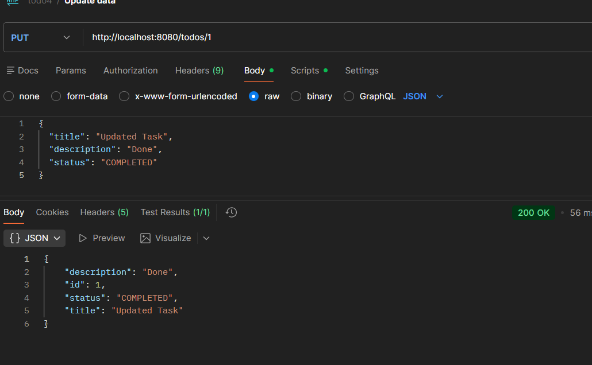
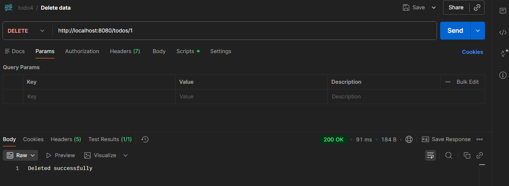

## Spring Boot Assignment — Session 4

## Overview

This project is part of the **Java Training Assignment (Advanced Spring Boot)**.  
It demonstrates the development of a RESTful Todo Application using **Spring Boot, JPA, and layered architecture**.

The application follows best practices such as DTO usage, validation, and separation of concerns.  
An **in-memory H2 database** is used, so no external database setup is required.

---

## Highlights

- Follows **Layered Architecture** (Controller → Service → Repository)
- Uses **Spring Boot + JPA (Hibernate)**
- Implements **DTO Pattern (No direct entity exposure)**
- Uses **Constructor-based Dependency Injection**
- Includes **Validation using @Valid**
- Handles **Exception globally**
- Uses **H2 In-Memory Database**
- Clean and maintainable code

---

## Tech Stack

- Java 17
- Spring Boot
- Spring Data JPA (Hibernate)
- H2 Database
- Maven

---

## Project Structure

- Controller → Handles API Requests
- Service → Business Logic
- Repository → Database Operations
- Entity → Database Model
- DTO → Data Transfer Object
- Mapper → DTO ↔ Entity Conversion
- Exception → Global Exception Handling

---

## How to Run the Project

1. Clone the repository
   git clone [github](https://github.com/gourshabrg/Assignment/tree/main/java/session4)
   cd java/session4/todo4

2. Build the project
   mvn clean install

3. Run the application
   mvn spring-boot:run
4. Access APIs at
   http://localhost:8080

---

## API Endpoints

### Todo APIs

This module handles all Todo operations such as creating, retrieving, updating, and deleting tasks.

---

### Create Todo

- Endpoint: `/todos`
- Method: POST
- Description: Creates a new todo

---

### Get All Todos

- Endpoint: `/todos`
- Method: GET
- Description: Returns all todos

---

### Get Todo by ID

- Endpoint: `/todos/{id}`
- Method: GET
- Description: Returns a specific todo

---

### Update Todo

- Endpoint: `/todos/{id}`
- Method: PUT
- Description: Updates title, description, and status

---

### Delete Todo

- Endpoint: `/todos/{id}`
- Method: DELETE
- Description: Deletes a todo

---

## Business Rule

Allowed status transitions:

- PENDING → COMPLETED
- COMPLETED → PENDING

If an invalid transition is attempted, an error is returned.

---

## API Testing (Postman)

### Create Todo

---

### Get All Todos

---

### Get Todo by ID

---

### Invalid ID Error

---

### Update Todo

---

### Delete Todo

---
