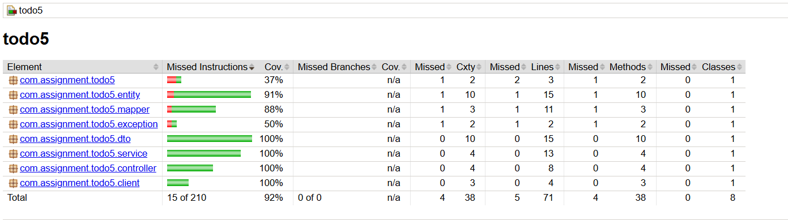

# Spring Boot Assignment — Enterprise Flow & Testing (Session 4)

## Overview

This project is part of the **Java Training Assignment (Advanced Spring Boot — Enterprise Flow & Testing)**.
It demonstrates a **production-level RESTful Todo Application** enhanced with logging, testing, and clean architecture practices.

The application is built using **Spring Boot, JPA, and an in-memory H2 database**, following enterprise standards such as layered architecture, DTO pattern, and dependency injection.

---

## Enhancements (As per Assignment Requirements)

The following enhancements have been implemented over the base Todo application:

### 1. Logging (Mandatory)

- Implemented **SLF4J Logging**
- Added logs in:
  - Controller layer (API calls)
  - Service layer (business logic execution)

---

### 2. Unit Testing (85% Coverage)

- Implemented **JUnit + Mockito**
- Covered:
  - Service Layer (business logic)
  - Controller Layer (API testing using MockMvc)
  - Mapper, DTO, Entity (for full coverage)

- Achieved **≥ 85% code coverage**

---

### 3. External Service Simulation

- Created:
  `NotificationServiceClient`
- Called from Service Layer when:
  - A new TODO is created

- Example:
  "Notification sent for new TODO"

---

### 4. Exception Handling

- Implemented **Global Exception Handler**
- Handles:
  - Invalid ID
  - Business rule violations
  - General runtime exceptions

---

## Architecture

Follows strict **Layered Architecture**:

```
Controller → Service → Repository
```

| Layer      | Responsibility              |
| ---------- | --------------------------- |
| Controller | Handles API requests        |
| Service    | Business logic              |
| Repository | Database operations         |
| DTO        | Data transfer               |
| Mapper     | DTO ↔ Entity conversion     |
| Exception  | Global error handling       |
| Client     | External service simulation |

---

## Tech Stack

- Java 17
- Spring Boot
- Spring Data JPA (Hibernate)
- H2 Database
- Maven
- JUnit + Mockito

---

## Key Concepts Implemented

- Constructor-based Dependency Injection
- IoC (Inversion of Control)
- DTO Pattern (No direct entity exposure)
- Manual DTO Mapping
- Validation using `@Valid`
- Separation of Concerns

---

## How to Run the Project

### 1. Clone Repository

```
git clone https://github.com/gourshabrg/Assignment
cd java/session5/todo5
```

### 2. Build Project

```
mvn clean install
```

### 3. Run Application

```
mvn spring-boot:run
```

### 4. Access APIs

```
http://localhost:8080
```

---

## API Endpoints

### Create Todo

- POST `/todos`

### Get All Todos

- GET `/todos`

### Get Todo by ID

- GET `/todos/{id}`

### Update Todo

- PUT `/todos/{id}`

### Delete Todo

- DELETE `/todos/{id}`

---

## Testing

### Tools Used:

- JUnit
- Mockito
- MockMvc

### Coverage:

- Achieved **85%+ coverage**

### Test Scope:

- Service logic
- API endpoints
- DTO & Mapper

---

## Database

- Uses **H2 In-Memory Database**
- No external setup required

### Access H2 Console:

```
http://localhost:8080/h2-console
```

---

## API Testing (Postman)

- Create Todo
- Get All Todos
- Get Todo by ID
- Update Todo
- Delete Todo
- Error Handling

(Screenshots included in `output-image/` folder)

---

## 📌 Conclusion

This project demonstrates:

- Clean architecture
- Enterprise-level coding practices
- Proper testing strategy
- Scalable backend design

---

MCA — NIT Jamshedpur

---

## API Testing (Postman)

### Create Todo


---

### Get All Todos


---

### Get Todo by ID


---

### Invalid ID Error


---

### Update Todo


---

### Delete Todo


### Test



---
